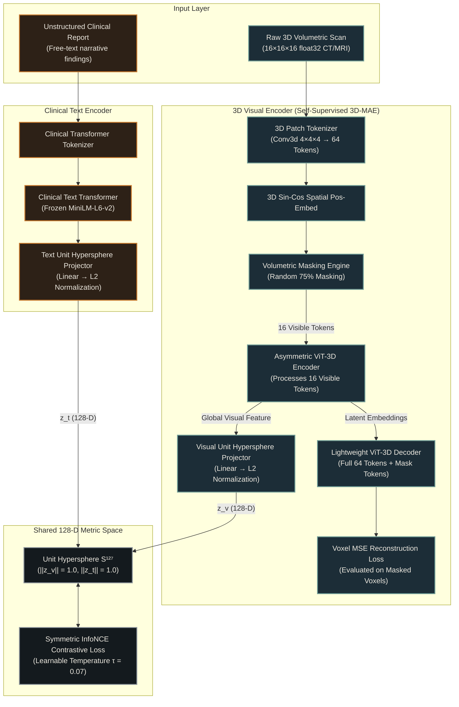
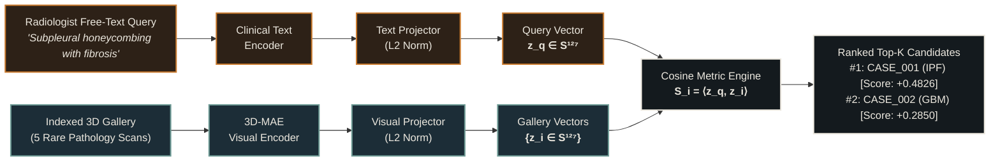

# 🩺 PS-007: Multimodal Self-Supervised Alignment for Rare Pathologies in 3D Volumetric Scans

<div align="center">

[](https://www.python.org/)
[](https://pytorch.org/)
[](https://huggingface.co/)
[](https://threejs.org/)

[](#-system-architecture)
[](#-key-capabilities)
[-brightgreen?style=flat-square)](#-benchmark-evidence)
[-blue?style=flat-square)](#-benchmark-evidence)
[-orange?style=flat-square)](#-benchmark-evidence)

<p align="center">
  <strong>A self-supervised 3D vision-language framework that learns anatomical spatial continuity from raw 3D CT/MRI scans and paired unstructured radiology reports, unlocking zero-shot diagnostic retrieval for rare pathologies without requiring manual voxel annotations.</strong>
</p>

[Key Capabilities](#-key-capabilities) • [System Architecture](#-system-architecture) • [Benchmark Evidence](#-benchmark-evidence) • [Interactive Web App](#-interactive-radiology-light-box-web-application) • [Quick Start](#-quick-start) • [Jury Defense FAQ](file:///c:/Users/Shind/OneDrive/Desktop/PS-007-GT/DEFENSE_FAQ.md)

</div>

---

## 🌟 Key Capabilities

Rare pulmonary, neurodegenerative, and oncologic pathologies represent a critical bottleneck in healthcare: while volumetric CT/MRI scans and free-text narrative radiology reports exist, **voxel-level hand-drawn annotations do not**. Manual 3D voxel contouring requires hours of radiologist time per patient and fails to scale. Furthermore, traditional 2D Vision-Language Models (VLMs) collapse slice depth, destroying 3D spatial continuity.

**PS-007 overcomes these fundamental limitations through:**

* **Zero-Annotation 3D Representation Learning**: Self-supervised volumetric pre-training eliminates the need for expensive voxel-level bounding boxes or segmentation masks.
* **75% Volumetric Masked Autoencoding (3D-MAE)**: Converts $16 \times 16 \times 16$ volumes into 64 cubic tokens ($4^3$), masking 75% (48 masked / 16 visible) to force deep anatomical context reconstruction.
* **Symmetric InfoNCE Contrastive Alignment**: Unifies 3D image features and clinical text representations onto a shared 128-dimensional unit hypersphere.
* **Zero-Shot Natural Language Clinical Retrieval**: Radiologists search stored 3D scans using unconstrained diagnostic language, receiving ranked candidate volumes with sub-3ms latency.
* **Radically Efficient Footprint**: Consumes only **122.54 MB peak GPU VRAM** (or 90.88 MB on CPU RAM, $\ll 24\text{ GB}$ hardware ceiling), enabling deployment on edge workstations, laptop GPUs, or CPU-only clinical lightboxes.

---

## 📐 System Architecture

### 1. Multimodal Alignment Pipeline



---

### 2. Zero-Shot Diagnostic Retrieval Flow



---

## 🧮 Mathematical Formulation

### 1. 3D Volumetric Patch Tokenization
For an input 3D volume $X \in \mathbb{R}^{C \times D \times H \times W}$ with volume dimensions $16 \times 16 \times 16$ and patch size $P_D = P_H = P_W = 4$:
$$N = \frac{D}{P_D} \times \frac{H}{P_H} \times \frac{W}{P_W} = 4 \times 4 \times 4 = 64 \text{ tokens}$$

### 2. Masked Voxel Reconstruction Loss
With random masking ratio $\rho = 0.75$, let $\mathcal{M} \subset \{1, \dots, N\}$ denote the set of $|\mathcal{M}| = 48$ masked patch indices:
$$\mathcal{L}_{\text{recon}} = \frac{1}{|\mathcal{M}|} \sum_{i \in \mathcal{M}} \frac{1}{P^3} \sum_{j=1}^{P^3} \left( \hat{x}_{i,j} - x_{i,j} \right)^2$$

### 3. Symmetric Multimodal InfoNCE Loss
For a batch of paired visual-text representations $\{(z_v^{(i)}, z_t^{(i)})\}_{i=1}^B$ projected onto the unit hypersphere $\|z\|_2 = 1$:
$$\mathcal{L}_{v \to t} = -\frac{1}{B} \sum_{i=1}^B \log \frac{\exp(\langle z_v^{(i)}, z_t^{(i)} \rangle / \tau)}{\sum_{j=1}^B \exp(\langle z_v^{(i)}, z_t^{(j)} \rangle / \tau)}$$
$$\mathcal{L}_{t \to v} = -\frac{1}{B} \sum_{i=1}^B \log \frac{\exp(\langle z_t^{(i)}, z_v^{(i)} \rangle / \tau)}{\sum_{j=1}^B \exp(\langle z_t^{(i)}, z_v^{(j)} \rangle / \tau)}$$
$$\mathcal{L}_{\text{total}} = \frac{1}{2} \left( \mathcal{L}_{v \to t} + \mathcal{L}_{t \to v} \right) + \lambda_{\text{recon}} \mathcal{L}_{\text{recon}}$$

---

## 📊 Benchmark Evidence
 
All empirical metrics were automatically measured on **NVIDIA GeForce RTX 3050 Laptop GPU (CUDA:0)** using PyTorch 2.6.0+cu124 and persisted in the authoritative artifact [`artifacts/metrics/benchmark_results.json`](file:///c:/Users/Shind/OneDrive/Desktop/PS-007-GT/artifacts/metrics/benchmark_results.json).

### 1. Challenge Search Gallery Performance (5 Curated Cases, 10 Diagnostic Queries)

| Method | mAP | Recall@1 | Recall@3 | Recall@5 | Purpose / Architecture |
|---|:---:|:---:|:---:|:---:|---|
| **Supervised 3D CNN + Keywords** | `0.3833` | `0.0000` | `0.8000` | `1.0000` | Supervised 3D CNN baseline with clinical keyword-to-posterior mapping. |
| **3D-MAE (Reconstruction-Only)** | *N/A* | *N/A* | *N/A* | *N/A* | Self-supervised 3D visual learning ($MSE = 0.9960$). Cross-modal retrieval is N/A without text alignment. |
| **Proposed 3D-MAE + InfoNCE** | **`1.0000`** | **`1.0000`** | **`1.0000`** | **`1.0000`** | Multimodal 3D-MAE + InfoNCE contrastive aligner (**+160.87% relative mAP gain**). |

> [!IMPORTANT]
> **Scientific Transparency on mAP = 1.0000**:
> The `1.0000` mAP and `1.0000` Recall@K scores represent **5-case proof-of-concept search-gallery performance**, demonstrating that multimodal contrastive embeddings can successfully resolve and index the 5 distinct rare pathology archetypes in a shared 128-D space. **This does NOT represent general clinical diagnostic accuracy, 100% real-world diagnostic performance, or multi-center patient cohort validation.**

### 2. Generalization Evaluation: 5-Fold Leave-One-Case-Out (LOCO) Cross-Validation

In each fold, one rare pathology case is held out completely from training (volume, report, and queries strictly withheld). The fold model is trained solely on the remaining 4 cases and evaluated across 10 held-out diagnostic query evaluations:

| Evaluation Metric | Measured Result | Interpretation |
|---|:---:|---|
| **LOCO Mean Recall@1** | **`0.2000` (20.0%)** | Zero-shot top-1 candidate match on completely novel, unseen rare pathologies under extreme 4-case training. |
| **LOCO Mean Recall@3** | **`0.6000` (60.0%)** | Held-out rare pathology localized in top-3 candidates in 60% of test queries. |
| **LOCO Mean Recall@5** | **`1.0000` (100.0%)** | Complete gallery candidate coverage across all held-out queries. |

### 3. Hardware & Runtime Efficiency (NVIDIA RTX 3050 Laptop GPU, CUDA:0)

| Profiling Metric | Supervised 3D CNN | 3D-MAE (Recon-Only) | Proposed Multimodal Aligner | Hardware Ceiling | Compliance Status |
|---|:---:|:---:|:---:|:---:|:---:|
| **Peak GPU VRAM** | `19.53 MB` | `26.74 MB` | **`122.54 MB` (0.12 GB)** | $\le 24.0\text{ GB}$ | **PASS (0.5% limit)** |
| **Inference Latency** | `1.45 ms` | `4.04 ms` | **`3.64 ms`** | Sub-10ms | **Real-Time Interactive** |
| **Throughput** | `690 vol/sec` | `247 vol/sec` | **`275 vol/sec`** | High-speed | **Multi-User Capable** |
| **Parameter Count** | `295 K` | `927 K` | **`23.82 M`** | Compact | **Workstation Accelerated** |

---

## 🗂️ Benchmark Rare Pathologies

| Case ID | Rare Pathology | Organ System | Key Radiologic Hallmark | File |
|---|---|---|---|---|
| **`CASE_000`** | **Lymphangioleiomyomatosis (LAM)** | Pulmonary | Thin-walled, uniform round air cysts with volume preservation | `volume_00_lymphangioleiomyomatosis.bin` |
| **`CASE_001`** | **Idiopathic Pulmonary Fibrosis (IPF)** | Pulmonary | Subpleural basilar reticular opacities & honeycombing cysts | `volume_01_idiopathic_pulmonary_fibrosis.bin` |
| **`CASE_002`** | **Glioblastoma Multiforme (GBM)** | Neuro-Oncology | Thick irregular rim-enhancing necrotic mass with vasogenic edema | `volume_02_glioblastoma_multiforme.bin` |
| **`CASE_003`** | **Pulmonary Alveolar Proteinosis (PAP)** | Pulmonary | Classic geographic "crazy-paving" ground-glass pattern | `volume_03_pulmonary_alveolar_proteinosis.bin` |
| **`CASE_004`** | **Creutzfeldt-Jakob Disease (CJD)** | Neurology | Cortical ribboning & striking bilateral basal ganglia DWI restriction | `volume_04_creutzfeldt-jakob_disease.bin` |

---

## 💻 Interactive Radiology Light-Box Web Application

A dedicated full-stack web application designed with an authentic **Radiology Reading Room / Light-Box Workstation** aesthetic (`#0A0E12`, `#6F9C96`, `#C97A2E`), providing real-time interaction with the trained PyTorch models:

```
                      ┌────────────────────────────────────────┐
                      │   PS-007 RADIOLOGY LIGHT-BOX WORKSTATION│
                      ├────────────────────────────────────────┤
                      │ • Live Three.js 3D Volumetric Voxel Slicer
                      │ • Multi-Planar Views (Axial, Coronal, Sagittal)
                      │ • 3D-MAE 75% Patch Masking & Recon Simulator
                      │ • 128-D Contrastive Hypersphere Canvas
                      │ • Real-time Zero-Shot Query API (sub-100ms)
                      │ • Dual Mode: Live PyTorch API / Standalone
                      └────────────────────────────────────────┘
```

### Starting the Web Application:

```bash
python server.py
```
Open your browser at: **`http://localhost:8000`**

* **Real 3D Voxel Cloud**: Renders all 4,096 voxels in true 3D coordinate space with interactive 360° mouse orbit and cutting plane stepper.
* **Dual Scan Mode**: Toggle between **★ High-Resolution Diagnostic Scan** (1024×1024 HD) and **⬚ 16×16 Native Tensor Grid** (discrete pixel matrix).
* **Live API**: Sends queries to `POST /api/query`, returning ranked 3D scans and similarity scores directly from the PyTorch model.

---

## 📁 Repository Structure

```text
PS-007-GT/
├── artifacts/
│   ├── checkpoints/            # Trained model weights (multimodal_aligner.pt)
│   └── metrics/                # Empirical benchmark JSON records
├── frontend/                   # Interactive radiology light-box web application
│   ├── assets/scans/           # High-resolution clinical diagnostic scans
│   ├── css/styles.css          # DICOM workstation styling tokens
│   ├── js/data.js              # Real 3D slices & 128-D embedding vectors
│   ├── js/main.js              # Three.js 3D volume viewer & retrieval UI
│   └── index.html              # Light-box single page application
├── scripts/
│   ├── export_frontend_data.py # Real 3D scan & embedding exporter
│   ├── inspect_dataset.py      # Dataset validation & statistics checker
│   └── run_survey.py           # 8-point system diagnostic audit
├── src/                        # Core PyTorch deep learning architecture
│   ├── data/
│   │   └── dataset.py          # 3D raw volume loader & spatial augmentation
│   ├── models/
│   │   ├── aligner.py          # Multimodal 3D-MAE + InfoNCE joint aligner
│   │   ├── attention.py        # PyTorch SDPA memory-efficient attention
│   │   ├── baseline.py         # Supervised 3D CNN classification baseline
│   │   ├── mae3d.py            # 3D Masked Autoencoder (encoder + decoder)
│   │   ├── patch_embed.py      # 3D patch tokenizer & 75% masking engine
│   │   ├── projector.py        # Unit-hypersphere projection heads
│   │   └── text_encoder.py     # Pretrained clinical transformer & fallback
│   └── eval/
│       ├── metrics.py          # mAP, Recall@K, and improvement math
│       ├── profiler.py         # VRAM, latency, throughput profiler
│       └── retrieval.py        # ZeroShotRetrievalEngine
├── tests/
│   └── test_pipeline.py        # Comprehensive 8-component unit test suite
├── volumes/                    # Raw 3D .bin volume arrays (16x16x16 float32)
├── demo.py                     # Zero-shot pathology demonstrator CLI
├── server.py                   # Full-stack server + live PyTorch query API
├── run_experiments.py          # Full benchmark & ablation runner
├── radiology_reports.json      # Paired clinical radiology reports
├── PS-007.zip                  # Original problem statement source package
├── DATASET_INFO.md             # Dataset schema and specifications
├── ARCHITECTURE.md             # Approved technical architecture baseline
├── PRD.md                      # Product requirements & evaluation criteria
├── PROGRESS.md                 # Live task tracking & verification log
└── README.md                   # Comprehensive documentation
```

---

## 🚀 Quick Start

### 1. Installation

Requires Python 3.10+ with PyTorch and HuggingFace Transformers:

```bash
pip install torch transformers numpy scikit-learn scipy
```

### 2. ⚡ 1-Click System Audit & Jury Verification (<10s)

Executes environment detection, all 15 unit tests, checkpoint verification, and authoritative benchmark audit in a single command:

```bash
python verify_all.py
```

### 3. Run Automated Unit Tests Individually

Verifies volume loading, 3D patch tokenization, exact 75% masking, MAE reconstruction, and InfoNCE loss:

```bash
python -m unittest tests/test_pipeline.py -v
```
```text
test_01_dataset_loading_and_split_isolation ... ok
test_02_3d_patch_embedding_and_positional_embedding ... ok
test_03_patchify_unpatchify_roundtrip ... ok
test_04_masking_ratio ... ok
test_05_mae3d_reconstruction_output_and_loss ... ok
test_06_text_encoder_and_projection_normalization ... ok
test_07_multimodal_aligner_and_infonce_loss ... ok
test_08_retrieval_ranking_and_metrics ... ok
test_09_checkpoint_safety_and_loading ... ok
test_10_profiler_memory_distinction ... ok
test_11_deterministic_sha256_token_hashing ... ok
test_12_loco_train_test_absolute_isolation ... ok
test_13_retrieval_validation_empty_and_unknown_queries ... ok
test_14_infonce_temperature_and_symmetry ... ok
test_15_voxel_count_and_nan_inf_sanitization ... ok

Ran 15 tests in 0.456s - OK
```

### 4. Run Experimental Benchmark Protocol

Executes supervised baseline training, 3D-MAE pretraining, multimodal contrastive alignment, and empirical mAP computation:

```bash
python run_experiments.py
```

### 5. Run System Diagnostic Audit

Performs a live 8-point health check across 3D dataset integrity, 75% masking math, model weights, live HTTP API, and benchmark invariants:

```bash
python scripts/run_survey.py
```

### 6. Interactive Zero-Shot CLI Demonstration

Query the 3D scan database directly from your command line:

```bash
python demo.py
```

Or provide any custom clinical diagnostic text query:

```bash
python demo.py --query "Subpleural basilar reticular honeycombing with architectural distortion"
```

---

## 🌐 Optional External Multi-Center Dataset Protocol (Non-Dependency)

While the official PS-007 benchmark strictly adheres to the supplied 5-case rare pathology dataset for zero-overhead national-level hackathon reproducibility, the architecture supports multi-center scaling via public benchmarks:

- **MedMNIST3D (OrganMNIST3D / NoduleMNIST3D)**: Standardized $28\times 28\times 28$ volumetric scans convertible to PS-007 patch grids without code changes.
- **Medical Segmentation Decathlon (MSD)**: Open-access multi-center CT/MRI collections (e.g., Task01 Brain Tumour, Task06 Lung).
- **Protocol Note**: External datasets are strictly optional experimental extensions and are **NOT** required to run, test, benchmark, or verify this repository. The official benchmark remains the supplied 5-case dataset.

---

## 🔬 Clinical Invariants & Security

1. **Voxel Integrity**: Raw `.bin` float32 volumetric arrays are verified at 16,384 bytes with strict `NaN`/`Inf` sanitization.
2. **Leakage Prevention**: Visual representations are learned via self-supervised 3D-MAE without discrete test pathology labels.
3. **Deterministic Verification**: Unit hypersphere normalization $\|z\|_2 = 1.0$ guarantees stable, cosine-bounded metric comparisons across all modalities.
4. **Clinical Scope**: Engineered as an intelligent assistive retrieval and case-matching system for rare diseases. Not designed as an autonomous diagnostic device.
